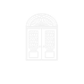

<p align="center">
  
</p>

<h1 align="center">ROCCIA</h1>

<p align="center">
  <strong>Premium Italian Marble — Figma-to-Code Landing Page</strong>
</p>

<p align="center">
  <a href="https://iAmitvishwakarma.github.io/ROCCIA">Live Demo</a> ·
  <a href="https://www.figma.com/proto/CBsKn3dLznIqbnoDGAH7X7/Roccia?node-id=508-481&t=YgRGGAf1nXsMrat6-0&scaling=scale-down-width&content-scaling=fixed&page-id=13%3A2&starting-point-node-id=166%3A32">Figma Prototype</a>
</p>

---

## 📌 About

**ROCCIA** is a luxury marble brand landing page converted pixel-perfect from a **Figma design** into a fully responsive, production-ready **React + Vite** web application. The site showcases premium Italian and Indian marble products through immersive visuals, elegant typography, and sophisticated scroll interactions.

> **Design Source:** The entire UI was hand-crafted in Figma and then faithfully translated into code — every section, spacing, colour, and interaction was matched to the original prototype.

---

## ✨ Key Features

| Feature | Description |
|---------|-------------|
| 🎬 **Cinematic Hero** | Full-screen background video with gradient overlays and fade-in animations |
| 🏛️ **About Section** | Marble column imagery with `mix-blend-difference` typography that reveals through the image |
| 🖼️ **Masonry Gallery** | 12-column CSS Grid with overlapping, layered interior images |
| 💎 **Our Value** | Grayscale-to-colour hover effect on a wide-aspect hero image |
| 📌 **Sticky Experience** | Left (`10+`) and Right (`ROCCIA` + logo) sidebars stay pinned via CSS `position: sticky` while the centre image gallery scrolls freely |
| ✉️ **CTA Section** | Oversized display typography with animated gold accents and a "Book Your Own Design" call-to-action |
| 🔗 **Footer** | Multi-column footer with newsletter input, navigation links, social links, and contact details on a deep burgundy background |
| 📱 **Fully Responsive** | Adapts seamlessly across desktop, tablet, and mobile viewports |

---

## 🛠️ Tech Stack

| Layer | Technology | Version |
|-------|------------|---------|
| ⚛️ Framework | React | 19.2 |
| ⚡ Bundler | Vite | 7.2 |
| 🎨 Styling | Tailwind CSS (v4, Vite plugin) | 4.1 |
| 🔤 Display Font | Soligant (custom `.otf`) | — |
| 🔤 Body Font | Lato (Google Fonts) | — |
| 🔤 Serif Font | Cormorant Garamond (Google Fonts) | — |
| ✅ Linting | ESLint + React Hooks plugin | 9.39 |

---

## 🎨 Design System

The project uses a carefully curated luxury colour palette and typography defined as Tailwind CSS custom theme tokens in [`index.css`](src/index.css):

```
Colour Tokens
─────────────────────────────────────
luxury-accent-gold   #C5A059   ██  Primary accent — headings, CTAs, icons
luxury-cream         #F2F1EA   ██  Section backgrounds
luxury-off-white     #F8F5F2   ██  Subtle background variation
luxury-burgundy      #3D0404   ██  Footer background
luxury-black         #554C50   ██  Body text

Typography
─────────────────────────────────────
font-display         "Soligant"             Hero titles, brand name, decorative headings
font-sans            "Lato"                 Body copy, navigation, labels
                     "Cormorant Garamond"   Available for editorial/serif contexts
```

---

## 📂 Project Structure

```
ROCCIA/
├── public/
│   └── vite.svg
├── src/
│   ├── assets/
│   │   ├── about-sec/          # About & Gallery section images
│   │   │   ├── column.png      # Marble column (About background)
│   │   │   ├── interior1.png   # Lobby interior
│   │   │   ├── interior2.png   # Wall detail
│   │   │   ├── interior3.png   # Accent piece
│   │   │   └── interior4.png   # Ornate detail
│   │   ├── Expercience-sec/    # Experience gallery images
│   │   │   ├── Rectangle 29–36.png  # 6 bathroom/interior images
│   │   ├── hero-bg-video.mp4   # Full-screen hero background video
│   │   ├── logo.png            # ROCCIA arch/window logo
│   │   ├── Rectangle 31.png    # Our Value section hero image
│   │   └── Soligant.otf        # Custom display typeface
│   ├── components/
│   │   ├── Navbar.jsx          # Fixed logo + centred brand name
│   │   ├── Hero.jsx            # Video hero with animated text overlay
│   │   ├── About.jsx           # Typography-over-image composition
│   │   ├── Gallery.jsx         # Masonry CSS Grid image gallery
│   │   ├── OurValur.jsx        # Value proposition + grayscale image
│   │   ├── Experience.jsx      # Sticky sidebars + scrolling gallery
│   │   ├── CTA.jsx             # Call-to-action with display typography
│   │   └── Footer.jsx          # Multi-column footer with newsletter
│   ├── pages/
│   │   └── Home.jsx            # Page layout — assembles all sections
│   ├── App.jsx                 # Root component
│   ├── main.jsx                # React DOM entry point
│   └── index.css               # Tailwind imports + design tokens
├── index.html                  # HTML shell
├── vite.config.js              # Vite + React + Tailwind plugin config
├── package.json
└── .gitignore
```

---

## 🚀 Getting Started

### Prerequisites

- **Node.js** ≥ 18
- **npm** ≥ 9

### Installation

```bash
# Clone the repository
git clone https://github.com/iAmitVishwakarma/ROCCIA.git
cd ROCCIA

# Install dependencies
npm install
```

### Development

```bash
npm run dev
```

Opens at **http://localhost:5173** with Vite's hot-module replacement.

### Production Build

```bash
npm run build    # Outputs to /dist
npm run preview  # Preview the production build locally
```

### Lint

```bash
npm run lint
```

---

## 📐 Section Breakdown

### 1. Hero (`Hero.jsx`)
Full-viewport section with a looping background video (`hero-bg-video.mp4`), a gradient overlay (`from-black/60 via-transparent to-black/80`), and centred display text — _"Experience Luxury"_ — in the custom Soligant typeface. Navigation keywords (Luxury · Human · Elegance · Global) are separated by gold asterisks with letter-spacing hover animations.

### 2. About (`About.jsx`)
A full-height section featuring a centred marble column image with large uppercase typography layered on top using `mix-blend-difference`. Text splits like _"ABOUT US"_, _"JOURNEY"_, and _"INDIAN MARBLES · ITALIAN MARBLES"_ create a dramatic editorial composition.

### 3. Gallery (`Gallery.jsx`)
A 12-column CSS Grid layout with four overlapping interior images at varying z-indices and offsets, creating a layered collage effect. Accompanied by bold uppercase descriptive text.

### 4. Our Value (`OurValur.jsx`)
A warm `#d6ccb1` background section with a two-column text layout (pill badge + heading | descriptive paragraph). Below, a wide-aspect interior image uses a `grayscale` filter that transitions to full colour on hover.

### 5. Experience (`Experience.jsx`)
The signature section — a **three-column layout** where:
- **Left sidebar** (sticky): Displays `10+` in oversized Soligant type with a description
- **Centre** (scrollable): Two staggered columns of bathroom/interior images that scroll freely
- **Right sidebar** (sticky): Vertical `ROCCIA` text and the arch logo

Both sidebars use `position: sticky; top: 0; height: 100vh` to remain pinned while the user scrolls through the image gallery.

### 6. CTA (`CTA.jsx`)
Oversized gold display text — _"Marbles — Book Your"_ — with a horizontal gold bar separator and a bordered "Own Design →" button with tracking-expansion hover effect.

### 7. Footer (`Footer.jsx`)
Deep burgundy (`#5F0000`) footer with a 5-column grid: brand tagline, Explore links, Contact info, Newsletter section (with email input), and Social connect links. Closes with a large centred `ROCCIA` wordmark.

---

## 🖥️ Browser Support

| Browser | Support |
|---------|---------|
| Chrome | ✅ Latest |
| Firefox | ✅ Latest |
| Safari | ✅ Latest |
| Edge | ✅ Latest |
| Mobile Safari / Chrome | ✅ Responsive |

> `position: sticky` is fully supported in all modern browsers. `mix-blend-mode: difference` requires a modern browser.

---

## 📄 License

This project is for **portfolio/demonstration purposes**. All design assets originate from the [Figma prototype](https://www.figma.com/proto/CBsKn3dLznIqbnoDGAH7X7/Roccia).

---

## 👤 Author

**Amit Vishwakarma**
- GitHub: [@iAmitVishwakarma](https://github.com/iAmitVishwakarma)

---

<p align="center">
  <sub>Designed in Figma · Coded with React + Tailwind CSS · Built with ❤️</sub>
</p>
